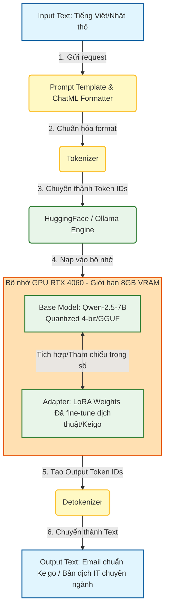
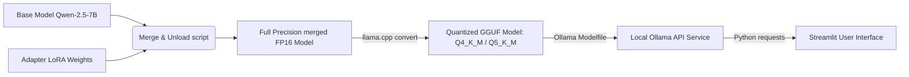

# FILE ĐỊNH HƯỚNG VÀ KẾ HOẠCH TRIỂN KHAI CHI TIẾT
## Dự án: AI Bridge Engineer (AI_Japanese)

Tài liệu này được biên soạn bởi **Senior AI Solution Architect** kiêm **Project Manager** nhằm định hướng công nghệ, kiến trúc hệ thống, kỹ thuật huấn luyện và lộ trình triển khai chi tiết cho dự án **AI_Japanese**. Trọng tâm của dự án là xây dựng một **Kỹ sư cầu nối ảo (AI Bridge Engineer)** chuyên dịch thuật thuật ngữ IT và chuẩn hóa văn phong email Kính ngữ (Keigo) Nhật - Việt, chạy tối ưu trên hạ tầng phần cứng cá nhân (RTX 4060 8GB VRAM).

---

## 1. KIẾN TRÚC HỆ THỐNG TỔNG THỂ (SYSTEM ARCHITECTURE)

### 1.1. Đề xuất Base Model & Lập luận kỹ thuật

Dựa trên cấu hình phần cứng:
*   **CPU**: Intel Core i9-13900HX (mạnh mẽ về tính toán CPU và xử lý dữ liệu đầu vào).
*   **RAM**: 16GB (đủ cho các tác vụ tải mô hình trung bình, nhưng sẽ bị giới hạn nếu chạy song song nhiều tác vụ nặng).
*   **GPU**: NVIDIA GeForce RTX 4060 Laptop GPU với **8GB GDDR6 VRAM**.
*   **Hệ điều hành**: Windows (có hao hụt ~0.6GB - 1GB VRAM cho giao diện Windows Display Driver Model - WDDM).

Chúng tôi đề xuất lựa chọn **Qwen-2.5-7B-Instruct** thay vì *Llama-3-8B-Instruct*. Dưới đây là bảng so sánh và lập luận chi tiết:

| Tiêu chí | Qwen-2.5-7B-Instruct (Đề xuất) | Llama-3-8B-Instruct | Đánh giá kỹ thuật & Lý do lựa chọn |
| :--- | :--- | :--- | :--- |
| **Kích thước tham số** | ~7.61 Billion | ~8.03 Billion | Qwen-2.5 nhỏ hơn một chút, giúp tiết kiệm khoảng **200MB - 350MB VRAM** khi huấn luyện và suy luận. |
| **Bộ từ vựng (Vocab Size)** | **151,643 tokens** | 128,256 tokens | Vocab của Qwen hỗ trợ đa ngôn ngữ cực tốt, đặc biệt tối ưu cho tiếng Nhật và tiếng Trung. Tokenizer của Qwen nén tiếng Nhật/Việt tốt hơn (ít token hơn trên cùng một đoạn văn bản), giúp giảm context window thực tế và tiết kiệm đáng kể VRAM. |
| **Độ dài ngữ cảnh tối đa** | Lên đến 128K tokens | 8K tokens | Dù chúng ta giới hạn ngữ cảnh khi huấn luyện để tránh OOM, khả năng mở rộng context của Qwen vượt trội khi cần tra cứu tài liệu dài. |
| **Hiệu năng tiếng Nhật** | Rất cao (Được huấn luyện trên tập dữ liệu Đông Á cực lớn) | Trung bình khá (Tập trung nhiều vào tiếng Anh) | Qwen-2.5 hiểu sâu sắc các sắc thái ngữ pháp tiếng Nhật, cấu trúc Kính ngữ (Keigo: Sonkeigo, Kenjougo, Teineigo) và thuật ngữ IT Nhật ngữ tốt hơn Llama-3. |
| **Mức tiêu thụ VRAM (Base)** | ~4.5 GB (ở định dạng Quantize 4-bit) | ~5.0 GB (ở định dạng Quantize 4-bit) | Rất sát nút thắt cổ chai 8GB VRAM trên Windows. Qwen-2.5-7B cho chúng ta thêm khoảng trống (headroom) an toàn để load Adapter LoRA mà không bị tràn VRAM. |

### 1.2. Sơ đồ luồng dữ liệu (Data Flow Diagram)

Dưới đây là luồng đi của dữ liệu từ khi người dùng nhập câu hỏi cho đến khi hệ thống trả về kết quả dịch thuật/viết email đã được tối ưu hóa qua Adapter LoRA.



---

## 2. KẾ HOẠCH CHUẨN BỊ DỮ LIỆU (DATA ENGINEERING)

Để mô hình học được cả **thuật ngữ chuyên ngành IT (dịch thuật Nhật-Việt)** lẫn **văn phong email Kính ngữ (Keigo) trong môi trường doanh nghiệp**, tập dữ liệu cần được thiết kế đa dạng nhưng nhất quán về cấu trúc.

### 2.1. Thiết kế cấu trúc Dataset (Định dạng JSONL)

Chúng tôi chọn định dạng **Conversational (Hội thoại)** chuẩn Hugging Face `trl` (SFTTrainer) để huấn luyện. Định dạng này giúp mô hình dễ dàng học cách đóng vai (System Prompt) và hội thoại tự nhiên.

#### Ví dụ 3 dòng dữ liệu mẫu (Dịch thuật IT & Chuẩn hóa Kính ngữ):

```json
{"messages": [{"role": "system", "content": "Bạn là một Kỹ sư cầu nối AI (AI Bridge Engineer). Nhiệm vụ của bạn là dịch thuật chính xác thuật ngữ IT giữa tiếng Nhật và tiếng Việt, hoặc chuyển đổi câu văn thông thường sang email kính ngữ Keigo chuyên nghiệp trong công việc."}, {"role": "user", "content": "Dịch câu này sang tiếng Nhật IT: 'Chúng tôi cần khởi tạo lại server deploy để áp dụng cấu hình cấu trúc database mới do khách hàng yêu cầu khẩn cấp.'"}, {"role": "assistant", "content": "お客様からの khẩn cấp のご要望に対応するため、データベースの新しい構成を適用すべく、デプロイサーバーを再起動する必要があります。"}]}
{"messages": [{"role": "system", "content": "Bạn là một Kỹ sư cầu nối AI (AI Bridge Engineer). Nhiệm vụ của bạn là dịch thuật chính xác thuật ngữ IT giữa tiếng Nhật và tiếng Việt, hoặc chuyển đổi câu văn thông thường sang email kính ngữ Keigo chuyên nghiệp trong công việc."}, {"role": "user", "content": "Viết lại câu sau sang dạng Keigo trang trọng để gửi cho đối tác: 'Tôi đã nhận được tài liệu thiết kế chi tiết (Detail Design) và đang kiểm tra nó.'"}, {"role": "assistant", "content": "詳細設計書を受領いたしました。現在,内容を確認しております。"}]}
{"messages": [{"role": "system", "content": "Bạn là một Kỹ sư cầu nối AI (AI Bridge Engineer). Nhiệm vụ của bạn là dịch thuật chính xác thuật ngữ IT giữa tiếng Nhật và tiếng Việt, hoặc chuyển đổi câu văn thông thường sang email kính ngữ Keigo chuyên nghiệp trong công việc."}, {"role": "user", "content": "Giải thích thuật ngữ 'デプロイ (Deploy)' và '本番環境 (Production Environment)' bằng tiếng Việt cho thành viên mới trong dự án."}, {"role": "assistant", "content": "- 'デプロイ (Deploy)' nghĩa là triển khai: Quá trình đưa mã nguồn của ứng dụng lên máy chủ để chạy thực tế.\n- '本番環境 (Production Environment)' nghĩa là môi trường vận hành thực tế (môi trường Product): Nơi hệ thống chạy thật và người dùng cuối trực tiếp tương tác, phân biệt với môi trường Staging (thử nghiệm) hay Development (phát triển)."}]}
```

### 2.2. Chiến lược thu thập và thu hẹp dữ liệu (Target: 2,000 - 5,000 cặp câu)

Với quy mô cá nhân, việc tự viết 5,000 cặp câu chất lượng cao là bất khả thi. Ta sẽ áp dụng chiến lược **Hybrid Data Generation & Curation**:

1.  **Khai thác Dataset mã nguồn mở có sẵn**:
    *   Sử dụng các bộ dịch thuật song ngữ Nhật - Việt công khai trên Hugging Face (ví dụ: `alt-translation-medium`, `iwslt15-ja-vi`) để lấy làm nền tảng dịch thuật cơ bản.
    *   Lọc ra các câu có chứa các từ khóa công nghệ thông tin (ví dụ: `サーバー`, `システム`, `開発`, `コード`, `仕様書`).
2.  **Sử dụng LLM mạnh (GPT-4o / Claude 3.5 Sonnet / Gemini 1.5 Pro) để sinh dữ liệu tự động (Synthetic Data Generation)**:
    *   *Kịch bản sinh dữ liệu dịch thuật IT*: Đưa vào danh sách 500 thuật ngữ IT Nhật-Việt thông dụng (Database, API, Frontend, Backend, CI/CD, Containerization...). Prompt cho LLM sinh ra các câu hội thoại thực tế của BrSE có chứa các từ khóa này ở cả 2 ngôn ngữ.
    *   *Kịch bản sinh dữ liệu Keigo*: Đưa vào các tình huống giao tiếp chuẩn trong dự án IT (Báo cáo tiến độ trễ, xin lỗi vì lỗi phát sinh, gửi tài liệu thiết kế, hẹn lịch họp, xác nhận yêu cầu thay đổi). Prompt cho LLM sinh ra câu văn thường (User) và câu văn kính ngữ tương ứng (Assistant).
3.  **Lọc nhiễu và làm sạch (Data Cleaning)**:
    *   Viết script Python loại bỏ trùng lặp (deduplication) bằng thuật toán SimHash hoặc cosine similarity của sentence embeddings.
    *   Giới hạn độ dài câu: Loại bỏ các câu quá dài (trên 350 tokens) để bảo vệ bộ nhớ VRAM khi train.

---

## 3. KẾ HOẠCH HUẤN LUYỆN KỸ THUẬT CHI TIẾT (TRAINING & FINE-TUNING PLAN)

Để huấn luyện thành công mô hình Qwen-2.5-7B trên **RTX 4060 8GB VRAM (Windows)** mà không bị lỗi Out-Of-Memory (OOM), chúng ta bắt buộc phải cấu hình cấu hình cực kỳ nghiêm ngặt bằng **QLoRA (Quantized Low-Rank Adaptation)**.

### 3.1. Cấu hình chi tiết các tham số Huấn luyện

Dưới đây là các tham số tối ưu khuyến nghị cho thư viện `transformers` và `peft` của Hugging Face:

#### Cấu hình QLoRA (BitsAndBytes & PEFT):
```python
from transformers import BitsAndBytesConfig
from peft import LoraConfig

# Cấu hình Quantization 4-bit tải mô hình nền
bnb_config = BitsAndBytesConfig(
    load_in_4bit=True,
    bnb_4bit_use_double_quant=True,       # Tiết kiệm thêm 0.4 bit/parameter
    bnb_4bit_quant_type="nf4",            # Kiểu dữ liệu tối ưu cho weights phân phối chuẩn
    bnb_4bit_compute_dtype=torch.bfloat16 # Dùng bfloat16 cho tính toán nếu GPU hỗ trợ (RTX 4060 hỗ trợ tốt), giúp ổn định loss
)

# Cấu hình LoRA Adapter
peft_config = LoraConfig(
    r=8,                                  # Rank thấp để giảm tham số huấn luyện (tiết kiệm VRAM)
    lora_alpha=16,                        # Tỉ lệ scaling thông thường (alpha = 2 * r)
    target_modules=[                      # Chỉ target vào các lớp Attention chính để giảm bộ nhớ
        "q_proj", 
        "v_proj",
        "k_proj",
        "o_proj"
    ],
    lora_dropout=0.05,
    bias="none",
    task_type="CAUSAL_LM"
)
```

#### Cấu hình TrainingArguments (HuggingFace `SFTTrainer`):
Chúng ta sử dụng bảng để giải thích cặn kẽ ý nghĩa từng tham số tối ưu hóa phần cứng:

| Tham số | Giá trị đề xuất | Giải thích chi tiết & Tác động VRAM |
| :--- | :--- | :--- |
| **`per_device_train_batch_size`** | `1` | **Bắt buộc**. Batch size lớn hơn 1 sẽ gây OOM lập tức trên 8GB VRAM khi xử lý mô hình 7B. |
| **`gradient_accumulation_steps`** | `8` | Tích lũy gradient qua 8 steps để có **Effective Batch Size = 8**, giúp mô hình hội tụ ổn định như khi train batch size lớn mà không tốn thêm VRAM. |
| **`learning_rate`** | `2e-4` | Mức học chuẩn và an toàn cho cấu hình QLoRA. |
| **`optim`** | `"paged_adamw_8bit"` | **Cực kỳ quan trọng**. Chuyển trạng thái optimizer sang 8-bit và tự động chuyển (page) dữ liệu sang RAM hệ thống khi VRAM bị quá tải cục bộ, ngăn chặn lỗi crash OOM. |
| **`gradient_checkpointing`** | `True` | **Bắt buộc**. Không lưu giữ toàn bộ activation maps của tất cả các lớp trong lượt forward pass, mà tính toán lại khi cần ở lượt backward. Giảm đến **60% lượng VRAM tiêu thụ** khi train. |
| **`max_seq_length`** | `512` | **Giới hạn nghiêm ngặt**. Giới hạn chiều dài đầu vào tối đa là 512 tokens. Do cơ chế Self-Attention có độ phức tạp bộ nhớ là $O(N^2)$, tăng lên 1024 hay 2048 sẽ tiêu tốn VRAM theo cấp số nhân. |
| **`fp16` / `bf16`** | `bf16=True` | Card đồ họa RTX 4000 series (Ada Lovelace) hỗ trợ native `bfloat16`, giúp tính toán nhanh hơn, không bị underflow/overflow như `float16` truyền thống. |
| **`logging_steps`** | `10` | In log thường xuyên để theo dõi loss ổn định. |
| **`warmup_ratio`** | `0.03` | Khởi động nhẹ nhàng tốc độ học để tránh phá vỡ trọng số ban đầu của mô hình nền. |

### 3.2. Quản trị rủi ro phần cứng trên Windows Laptop

Chạy huấn luyện LLM trên Laptop Geforce RTX 4060 có hai rủi ro lớn: **Tràn VRAM do WDDM Overhead** và **Quá nhiệt hệ thống (Thermal Throttling)**.

1.  **Xử lý giới hạn bộ nhớ trên Windows (WDDM)**:
    *   Windows tự động dành ra một phần VRAM làm bộ nhớ đệm hiển thị. Để tối ưu tối đa VRAM cho CUDA:
        *   Tắt hết các ứng dụng chạy ngầm ngốn GPU (Trình duyệt Chrome/Edge, Discord, Steam, Spotify).
        *   Trước khi chạy script train, cấu hình biến môi trường trong Python để dọn rác bộ nhớ:
            ```python
            import torch
            import gc
            gc.collect()
            torch.cuda.empty_cache()
            ```
2.  **Kiểm soát nhiệt độ phần cứng**:
    *   Laptop gaming tỏa nhiệt rất lớn khi GPU chạy 100% công suất liên tục trong nhiều giờ.
    *   **Giải pháp**:
        *   Kê cao đế laptop hoặc sử dụng đế tản nhiệt chuyên dụng.
        *   Sử dụng phần mềm như **Lenovo Vantage** chỉnh chế độ quạt sang **Extreme/Performance Mode** để đẩy tốc độ quạt tối đa.
        *   Giới hạn công suất GPU (TGP) thông qua MSI Afterburner hoặc chỉnh giới hạn nhiệt độ GPU Target xuống **75°C** để tránh hư hỏng linh kiện.

---

## 4. KẾ HOẠCH ĐÓNG GÓI & TRIỂN KHAI (DEPLOYMENT PHASE)

Sau khi quá trình huấn luyện hoàn tất và thu được file Adapter LoRA (chứa các file `.safetensors` hoặc `.bin` dung lượng rất nhỏ, chỉ khoảng 50MB - 100MB), ta tiến hành đóng gói để chạy cục bộ.



### 4.1. Quy trình Merge LoRA Weights vào Base Model

Vì mô hình gốc và Adapter chạy độc lập trong lúc train, ta cần gộp (merge) chúng lại thành một mô hình duy nhất dạng FP16 trước khi convert sang GGUF.

Chạy script Python sau:
```python
import torch
from transformers import AutoModelForCausalLM, AutoTokenizer
from peft import PeftModel

base_model_path = "Qwen/Qwen2.5-7B-Instruct"
adapter_path = "./best_lora_adapter" # Thư mục chứa weights sau khi train
output_path = "./merged_qwen_japanese"  # Thư mục lưu mô hình đã gộp

print("Loading base model...")
base_model = AutoModelForCausalLM.from_pretrained(
    base_model_path,
    torch_dtype=torch.float16, # Hoặc bfloat16
    device_map="cpu" # Merge trên CPU/RAM để tránh tràn VRAM GPU
)
tokenizer = AutoTokenizer.from_pretrained(base_model_path)

print("Loading adapter...")
model = PeftModel.from_pretrained(base_model, adapter_path)

print("Merging weights...")
merged_model = model.merge_and_unload()

print("Saving merged model...")
merged_model.save_pretrained(output_path)
tokenizer.save_pretrained(output_path)
print("Merge completed successfully!")
```

### 4.2. Quantize sang GGUF bằng `llama.cpp` và tích hợp Ollama

Định dạng **GGUF** tối ưu hóa cực tốt cho việc suy luận (inference) trên phần cứng consumer nhờ cơ chế phân bổ linh hoạt giữa GPU (VRAM) và CPU (RAM).

#### Bước 1: Convert và Quantize bằng `llama.cpp`
1.  Tải và cài đặt `llama.cpp` cho Windows.
2.  Chạy script convert từ thư mục merged sang định dạng GGUF FP16:
    ```bash
    python convert_hf_to_gguf.py merged_qwen_japanese --outfile qwen-ja-merged.gguf
    ```
3.  Thực hiện Quantize mô hình sang dạng 4-bit (`Q4_K_M` - cân bằng tốt nhất giữa dung lượng và độ chính xác) hoặc 5-bit (`Q5_K_M` nếu muốn dịch chính xác hơn, dung lượng file khoảng ~4.8GB):
    ```bash
    # Quantize sang Q4_K_M
    llama-quantize qwen-ja-merged.gguf qwen-ja-q4_k_m.gguf Q4_K_M
    ```

#### Bước 2: Tích hợp vào Ollama làm API cục bộ
1.  Cài đặt **Ollama** trên Windows.
2.  Tạo một file có tên `Modelfile` trong thư mục chứa file `.gguf` với nội dung cấu hình hệ thống:
    ```dockerfile
    FROM ./qwen-ja-q4_k_m.gguf

    # Cấu hình System Prompt mặc định cho Ollama
    SYSTEM """
    Bạn là một Kỹ sư cầu nối AI (AI Bridge Engineer). Nhiệm vụ của bạn là dịch thuật chính xác thuật ngữ IT giữa tiếng Nhật và tiếng Việt, hoặc chuyển đổi câu văn thông thường sang email kính ngữ Keigo chuyên nghiệp trong công việc. Hãy trả lời ngắn gọn, chuyên nghiệp và lịch sự.
    """

    # Cấu hình các tham số suy luận
    PARAMETER temperature 0.3
    PARAMETER top_p 0.9
    PARAMETER num_ctx 2048
    ```
3.  Chạy lệnh tạo mô hình trong Command Prompt / PowerShell:
    ```powershell
    ollama create ai-bridge-engineer -f Modelfile
    ```
4.  Kiểm tra và chạy thử mô hình:
    ```powershell
    ollama run ai-bridge-engineer
    ```
    Mô hình hiện đã chạy như một service cục bộ tại địa chỉ `http://localhost:11434/api/generate`.

### 4.3. Xây dựng giao diện UI nhanh bằng Streamlit

Tạo file `app.py` sử dụng thư viện Streamlit để tương tác trực quan với API Ollama:

```python
import streamlit as st
import requests
import json

# Cấu hình giao diện
st.set_page_config(page_title="AI Bridge Engineer (BrSE)", layout="wide")

st.title("🤖 Trợ Lý Kỹ Sư Cầu Nối Ảo - AI BrSE")
st.markdown("Hỗ trợ dịch thuật thuật ngữ IT & soạn thảo Email Kính ngữ (Keigo) Nhật - Việt.")

# Chọn chế độ tác vụ
task_mode = st.sidebar.selectbox(
    "Lựa chọn tác vụ:",
    ["Dịch thuật IT Nhật - Việt", "Dịch thuật IT Việt - Nhật", "Soạn Email Keigo (Kính ngữ)", "Tra cứu thuật ngữ"]
)

# Khung nhập liệu
user_input = st.text_area("Nhập nội dung yêu cầu tại đây:", height=150)

if st.button("Xử lý ngay", type="primary"):
    if not user_input.strip():
        st.warning("Vui lòng nhập nội dung cần xử lý!")
    else:
        with st.spinner("Đang xử lý dữ liệu qua mô hình cục bộ..."):
            # Chuẩn bị Prompt tùy thuộc vào tác vụ
            if task_mode == "Dịch thuật IT Nhật - Việt":
                prompt = f"Dịch đoạn văn IT sau từ tiếng Nhật sang tiếng Việt: {user_input}"
            elif task_mode == "Dịch thuật IT Việt - Nhật":
                prompt = f"Dịch đoạn văn IT sau từ tiếng Việt sang tiếng Nhật: {user_input}"
            elif task_mode == "Soạn Email Keigo (Kính ngữ)":
                prompt = f"Viết hoặc chuyển đổi đoạn văn sau sang dạng Email Kính ngữ Keigo trang trọng gửi đối tác Nhật: {user_input}"
            else:
                prompt = f"Giải thích thuật ngữ công nghệ sau: {user_input}"
            
            # Gọi API Ollama cục bộ
            url = "http://localhost:11434/api/generate"
            payload = {
                "model": "ai-bridge-engineer",
                "prompt": prompt,
                "stream": False
            }
            
            try:
                response = requests.post(url, json=payload)
                if response.status_code == 200:
                    result = response.json().get("response", "")
                    st.success("Kết quả xử lý từ AI:")
                    st.write(result)
                else:
                    st.error(f"Lỗi kết nối API Ollama: Mã trạng thái {response.status_code}")
            except Exception as e:
                st.error(f"Không thể kết nối đến Ollama. Hãy chắc chắn rằng lệnh 'ollama run ai-bridge-engineer' đang hoạt động cục bộ. Chi tiết lỗi: {e}")
```

Để khởi chạy ứng dụng web này, người dùng chỉ cần gõ lệnh sau trong Terminal:
```bash
pip install streamlit requests
streamlit run app.py
```

---

## 5. LỊCH TRÌNH TRIỂN KHAI CHI TIẾT TRONG 6 TUẦN

Lộ trình triển khai dự án được thiết kế theo phương pháp Agile/Scrum rút gọn, đảm bảo kiểm soát chặt chẽ tiến độ và chất lượng đầu ra sau mỗi chặng.

```mermaid
gantt
    title Kế hoạch Triển khai Dự án AI_Japanese (6 Tuần)
    dateFormat  YYYY-MM-DD
    section Chuẩn bị & Dữ liệu
    Tuần 1: Nghiên cứu & Thiết lập Môi trường     :active, w1, 2026-07-06, 7d
    Tuần 2: Thu thập & Làm sạch Dataset           :w2, after w1, 7d
    section Huấn luyện & Đánh giá
    Tuần 3: Huấn luyện QLoRA thử nghiệm & Tối ưu hóa :w3, after w2, 7d
    Tuần 4: Huấn luyện chính thức & Đánh giá kết quả :w4, after w3, 7d
    section Triển khai & Kiểm thử
    Tuần 5: Đóng gói GGUF, cấu hình Ollama & Viết UI  :w5, after w4, 7d
    Tuần 6: Kiểm thử tổng thể & Tối ưu hóa UI/Hiệu năng :w6, after w5, 7d
```

### Bảng phân rã công việc (WBS - Work Breakdown Structure):

| Tuần | Mục tiêu chính | Công việc chi tiết | Sản phẩm đầu ra (Deliverables) |
| :--- | :--- | :--- | :--- |
| **Tuần 1** | **Thiết lập Môi trường & Nghiên cứu** | - Cài đặt Miniconda, Python 3.10+, PyTorch CUDA trên Windows.<br>- Cấu hình Git cho workspace.<br>- Tải và chạy thử base model `Qwen/Qwen2.5-7B-Instruct` qua Hugging Face để đo lường lượng VRAM cơ bản lúc suy luận (Inference baseline benchmark). | - Môi trường lập trình Python/CUDA sẵn sàng.<br>- File script kiểm tra card đồ họa CUDA hoạt động.<br>- Báo cáo mức chiếm dụng VRAM tĩnh. |
| **Tuần 2** | **Kỹ nghệ Dữ liệu (Data Engineering)** | - Thu thập danh sách từ vựng IT Việt-Nhật thông dụng.<br>- Sử dụng API sinh tự động (Synthetic data) các câu mẫu Keigo và dịch thuật IT.<br>- Viết script Python loại bỏ trùng lặp dữ liệu, lọc bỏ các dòng có token quá dài.<br>- Chia bộ dữ liệu thành Train/Validation theo tỉ lệ 90/10 ở dạng JSONL. | - Bộ dữ liệu `train.jsonl` và `val.jsonl` sạch (2,000 - 5,000 dòng).<br>- Script Python thống kê độ dài token (token length distribution chart). |
| **Tuần 3** | **Cấu hình & Huấn luyện Thử nghiệm (Prototype)** | - Cài đặt thư viện: `peft`, `trl`, `transformers`, `bitsandbytes` (phiên bản Windows-native).<br>- Viết mã nguồn huấn luyện `train.py` tích hợp QLoRA.<br>- Thực hiện chạy thử nghiệm với 50 epochs nhỏ (100 dòng dữ liệu) để kiểm tra lỗi tràn bộ nhớ (OOM) và kiểm soát nhiệt độ phần cứng laptop. | - Script huấn luyện `train.py` chuẩn chỉnh.<br>- Nhật ký giám sát nhiệt độ GPU và VRAM trong quá trình chạy thử nghiệm. |
| **Tuần 4** | **Huấn luyện Mô hình Chính thức** | - Tiến hành chạy huấn luyện chính thức toàn bộ tập dữ liệu (1-3 epochs tuỳ theo biểu đồ loss).<br>- Giám sát quá trình huấn luyện qua Wandb (Weights & Biases) hoặc TensorBoard.<br>- Đánh giá định tính chất lượng câu sinh ra bằng cách nhập thử một số mẫu email thực tế từ công việc BrSE để xem mô hình có bị quá khớp (overfitting) hay không. | - Thư mục lưu trọng số LoRA Adapter tối ưu nhất (`./best_lora_adapter`).<br>- Biểu đồ Loss huấn luyện giảm dần ổn định dưới mức 1.5. |
| **Tuần 5** | **Đóng gói & Phát triển Giao diện (UI)** | - Viết script gộp (merge) LoRA weights vào mô hình gốc Qwen-2.5.<br>- Cài đặt và build `llama.cpp` trên Windows.<br>- Quantize mô hình sang định dạng GGUF (`Q4_K_M` || `Q5_K_M`).<br>- Tạo cấu hình `Modelfile`, import mô hình vào Ollama.<br>- Viết giao diện người dùng bằng Streamlit tương tác qua API. | - File mô hình đã quantize `qwen-ja-q4_k_m.gguf`.<br>- Service Ollama `ai-bridge-engineer` chạy ngầm.<br>- File giao diện web `app.py`. |
| **Tuần 6** | **Kiểm thử hệ thống & Tối ưu hóa (UAT)** | - Chạy kiểm thử toàn diện giao diện người dùng trên máy local.<br>- Đo lường tốc độ sinh từ (Tokens per second) trên cấu hình RTX 4060.<br>- Khắc phục các lỗi hiển thị hoặc lỗi mất kết nối API.<br>- Viết tài liệu hướng dẫn vận hành và hướng dẫn cài đặt nhanh cho người dùng cuối. | - Ứng dụng AI Bridge Engineer chạy mượt mà, không giật lag.<br>- File hướng dẫn sử dụng nhanh (Readme.md).<br>- Kết thúc dự án và bàn giao mã nguồn. |

---

## 6. KẾ LOẠN & KHUYẾN NGHỊ CỦA ARCHITECT

Để dự án đạt hiệu quả cao nhất trên cấu hình laptop cá nhân, chúng tôi khuyến nghị:
1.  **Luôn ưu tiên độ sạch của dữ liệu**: LLM kích thước nhỏ (7B) học rất nhạy với dữ liệu nhiễu. 2,000 dòng dữ liệu dịch thuật được rà soát thủ công kỹ lưỡng sẽ mang lại chất lượng tốt hơn 10,000 dòng dữ liệu dịch máy cẩu thả.
2.  **Đừng bỏ qua việc Paging bộ nhớ**: Hãy đảm bảo `"paged_adamw_8bit"` luôn được kích hoạt. Trình điều khiển CUDA trên Windows đôi khi sẽ kéo RAM hệ thống để bù đắp VRAM thiếu hụt, tốc độ train sẽ bị chậm đi đáng kể nhưng bảo đảm quá trình huấn luyện không bị dừng đột ngột giữa đêm.
3.  **Tối ưu hóa tham số `temperature` lúc suy luận**: Với tác vụ dịch thuật và Keigo, hãy để nhiệt độ thấp (`0.1` - `0.3`) để kết quả mang tính nhất quán và chính xác cao nhất. Tránh để nhiệt độ cao gây ra hiện tượng ảo giác (hallucination) từ vựng IT.
